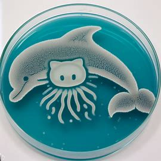
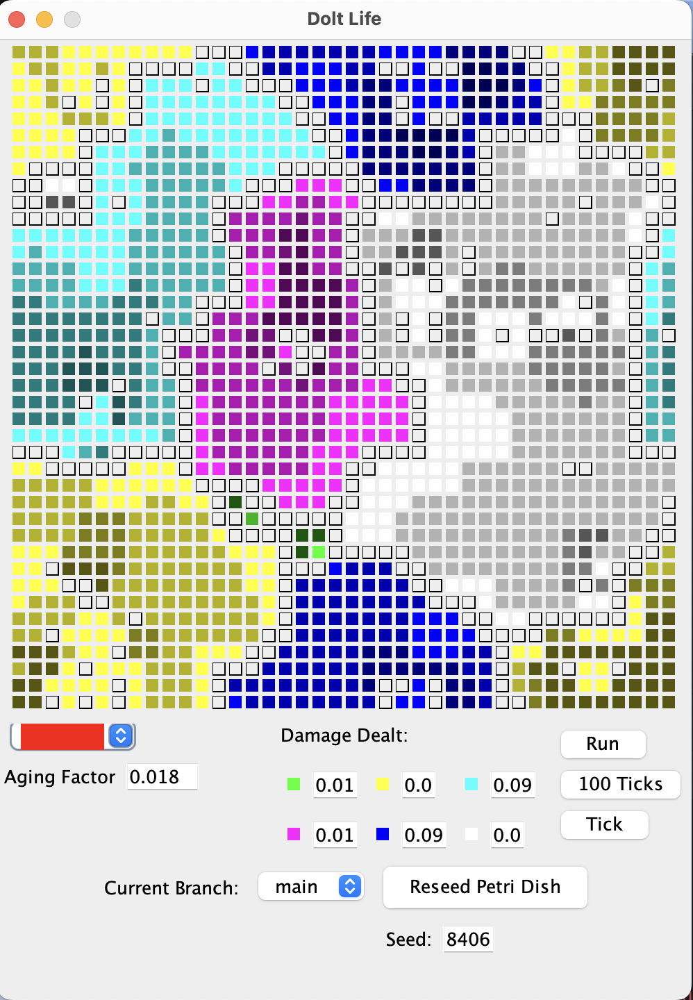

# PetriDish
Petri Dish is an application to demonstrate the use of Hibernate on Dolt. It is a Java Swing application which works against
a locally running instance of a Dolt database. It's a variation on [Conways's Game of Life](https://en.wikipedia.org/wiki/Conway%27s_Game_of_Life), and it uses Dolt to record all game state so experiments can be shared with others.

When setup and running, you'll have an application which looks like this:



# Setup
## Getting the Database
The example database for this application can be found on [DoldHub](https://www.dolthub.com/repositories/dolthub/HibernatePetriDish).

If you don't have Dolt installed, [install it](https://docs.dolthub.com/introduction/installation), then clone the example database:
```sh
$ dolt clone dolthub/HibernatePetriDish
$ cd HibernatePetriDish
```

The application works with local branches currently, so you can create branches as you see fit. To see all remote branches, run
`dolt branch -a`. Create branches as follows:

```sh
$ dolt branch br1 origin/br1
$ dolt branch squares origin/squares
```

Start a dolt sql-server:
```sh
$ dolt sql-server -u root -p r00tr00t --loglevel debug
```
This will create a local server on port 3333. You can interact with the server using a MySQL client or by running `dolt sql` in the root directory. The password matters - it is coded into the [hibernate configuration](src/main/resources/hibernate.cfg.xml), and you
are welcome to change it.

Once this server is running, leave the terminal open so you can see the logs. The `--loglevel` is specified so you can see all queries that are being performed by the application when it is running.

## Building and Running the PetriDish Application
Prequisites are Java and Maven.
 * Install Java. I used [OpenJDK](https://openjdk.org/install/), but [Oracle's JVM](https://www.oracle.com/java/technologies/downloads/) will work as well.
 * [Install Maven](https://maven.apache.org/install.html)

Then build the sample application. In the root directory of this repository, package then run the code:
```
$ mvn package
$ mvn exec:java
```

# Code Layout
All classes are found within [one directory](https://github.com/dolthub/hibernate-sample/tree/main/src/main/java/com/dolthub). There is currently no testing. YOLO. The notable classes:
* [PetriDishMain](https://github.com/dolthub/hibernate-sample/blob/main/src/main/java/com/dolthub/PetriDishMain.java) This is where the `main()` method resides. This class implements the [`DatabaseInterface`](https://github.com/dolthub/hibernate-sample/blob/main/src/main/java/com/dolthub/DatabaseInterface.java) which is all interactions with the Dolt database.
* Data Access Objects: All classes starting with `Dao*` are entity object used by Hibernate to manage data. Mostly boiler plate, but some mapping of values to better Java objects than their raw form in the database
* [HibernateUtil](https://github.com/dolthub/hibernate-sample/blob/main/src/main/java/com/dolthub/HibernateUtil.java): Simplifies the creation of Sessions. Includes the alteration of the connection URL to use Dolt branches.
* [hibernate.cfg.xml](https://github.com/dolthub/hibernate-sample/blob/main/src/main/resources/hibernate.cfg.xml)
* [GameState](https://github.com/dolthub/hibernate-sample/blob/main/src/main/java/com/dolthub/GameState.java) Controls the running of the game. Each tick on the board, and the rules which govern the experiment are here.
* GUI Classes. All prefixed with `Gui*`, this render the game on screen.

# PetriDish Life Rules
Similar to Conway's Game of Life, the Dolt Petri Dish has a set of simple rules with define how cells live and die.
 * Each Cell has a health between 0.0 and 1.0. If a cell's health falls to 0.0, it dies.
 * Each Species ages, and each tick will decrease the health of the cell as is determined by the Species table data.
 * Each tick the 8 neighboring cells will impact this cell by decreasing health of the cell as determined by the damage caused by the neighboring cell.
 * If a cell is unoccupied at the beginning of the tick, if it has 3-5 occupied neighbors, the that cell will be given life in the form of the species which has the highest count of neighbors. New cells are always born with 1.0 strength. If there is not a dominant neighboring cell species (one species count that is higher than all others), then the cell will remain dead.
